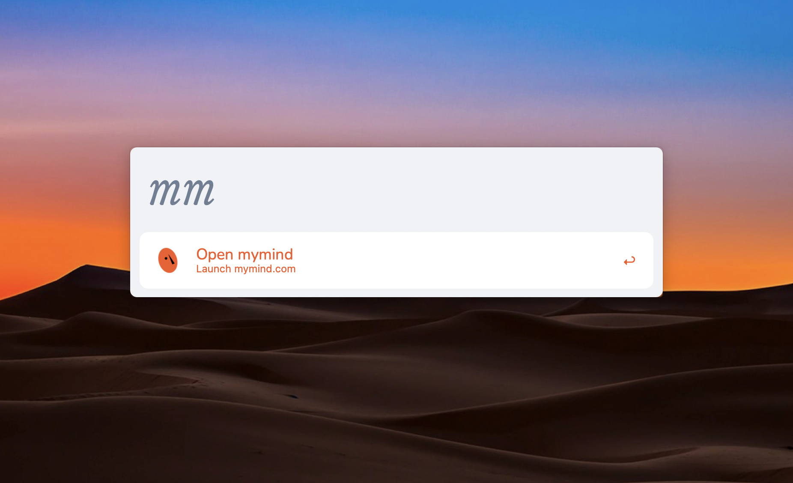
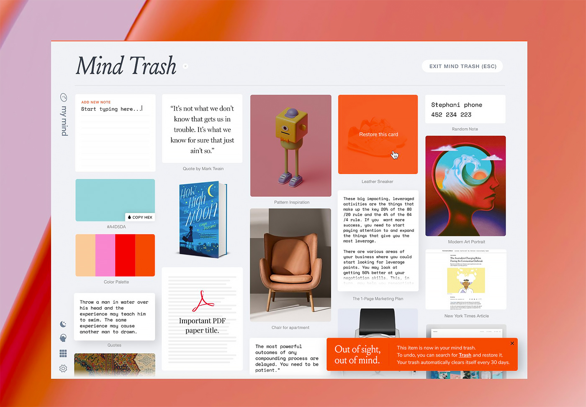

# mymind Theme for Alfred Powerpack
An Alfred theme based on the mymind aesthetic 

[**Download from latest release**](https://github.com/aleksbatista/alfred-theme-mymind/releases/latest)

## Installation
The theme uses two fonts, [Nunito](https://fonts.google.com/specimen/Nunito) and [Luize](https://www.205.tf/Font/23/louize/) (fantastic trial provided by 205TF foundry). You'll need these installed first. 

Afterwards unzip the downloaded file and double-click the `.alfredappearance` to install it.

## Previews

### Theme Preview

### mymind Reference

## About

Content unaffiliated with mymind

<a href="https://www.alfredforum.com/topic/16527-mymind-inspired-theme/">Post on Alfred Forums</a>
